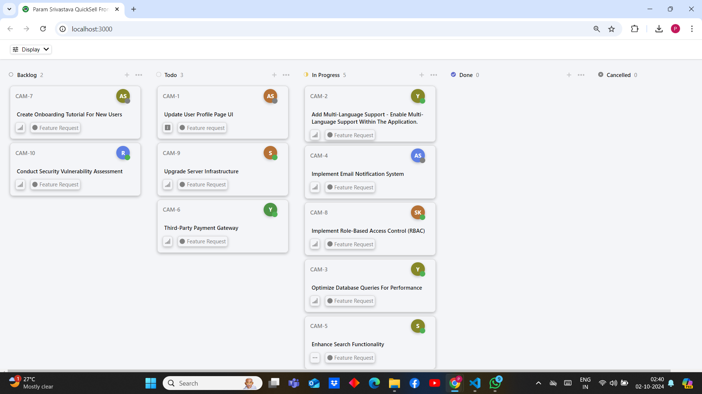

# QuickSell Frontend Assignment by Param Srivastava

## Overview

This project is a Kanban board application developed using ReactJS. It enables users to interact with ticket data retrieved from the **Quicksell API**. Users can organize and sort tickets based on various criteria, making it a flexible tool for managing projects. Check out the live version of the project at [Link](https://quicksell-frontend-ashen.vercel.app/).

## Home page Look(Zoomed Out)



## Features

- **Data Transaction:**

  - Retrieves ticket data from the Quicksell API.
  - Displays the retrieved data on a Kanban board.

- **Grouping:**

  - Group tickets by Status, User, or Priority.

- **Sorting:**

  - Sort tickets by Priority or Title.

- **Priority:**

  - Tickets are classified with priority levels ranging from Urgent (4) to No Priority (0).

- **Styling:**

  - Features a visually appealing and responsive design.
  - Uses pure CSS for styling.

- **Icons:**

  - Integrates icons for various elements of the application using react-icon.

- **State Persistence:**

  - Preserves the user's view state (grouping and sorting options) even after a page refresh through local storage.

## Setup

1. **Cloning the Repository:**

   ```bash
   git clone https://github.com/Param-Srivastava/Quicksell-Frontend.git
   ```

2. **Installation of Dependencies:**

   ```bash
   npm install
   ```

3. **Running the Application:**

   ```bash
   npm start
   ```

4. **Where to find your Application:**
   Open your browser and go to `http://localhost:3000`.
